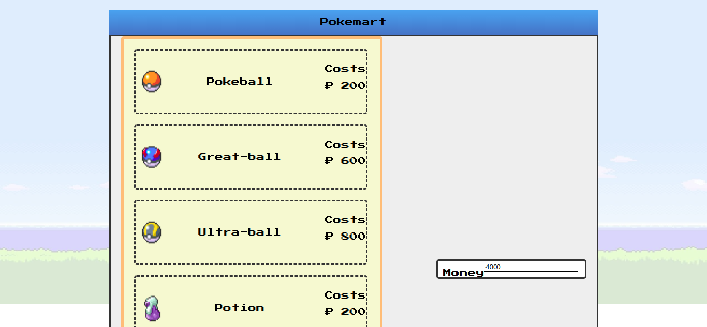
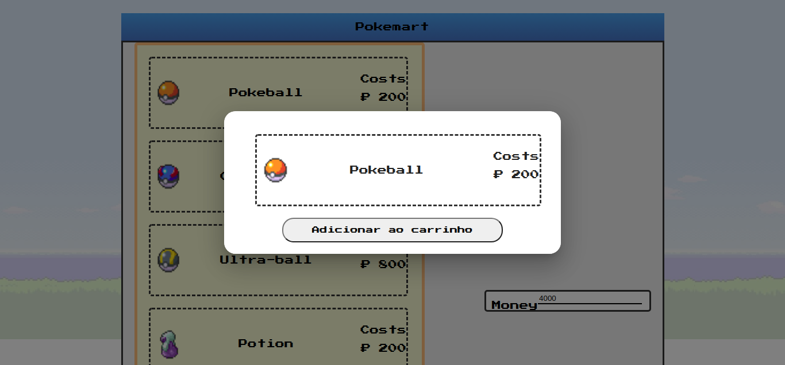
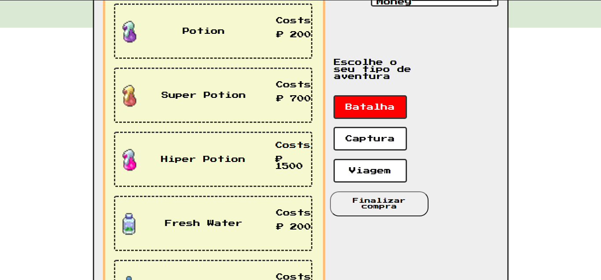

# PokeMart

**Número da Lista**: 5 
**Conteúdo da Disciplina**: Programação Dinâmica 

## Alunos
|Matrícula | Aluno |
| -- | -- |
| 15/0120630  |  Caio Oliveira de Moraes |
| 16/0015294  |  Matheus Rodrigues do Nascimento |

## Sobre 
Muitas vezes na avenutura pokemon é preciso escolher o que comprar e como gastar o seu dinhiero, com o pokemart ficou mais fácil esoclher como gastar seu dinhiero, informe quanto de dinheiro você possui, os itens de deseja levar em sua jornada e qual o seu foco, batalha, capturar novos pokemnos ou viajar, assim o pokemart fara uma otimização em quais itens você deve levar de acordo com seu tipo de aventura. 

## Screenshots

## Instalação 
**Linguagem**: Javascript 
**Framework**: React 
Descreva os pré-requisitos para rodar o seu projeto e os comandos necessários.

## Uso 

Instale as dependencias

`yarn `

Rode a aplicação com o comando 

`yarn start`

Acesse o pokemart na página

`localhost:3000`

## Outros 
O vídeo se encontra na pasta assets

